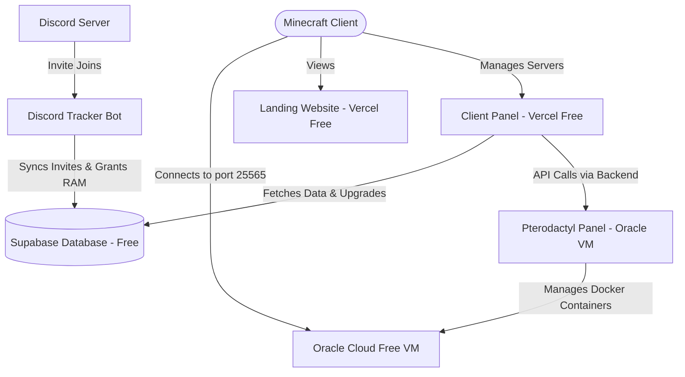

# KromaNodes - Zero-Investment Setup Guide

This guide walks you through setting up a premium Minecraft hosting business with **$0 setup or monthly cost**, utilizing free-tier hosting for your web files, databases, and actual game servers.

---

## Architecture Overview



---

## Step 1: Choosing Your Free Game Node Infrastructure

To host Minecraft servers for $0, you have two main routes for your infrastructure nodes:

---

### Option A: Oracle Cloud Infrastructure (OCI) Free Tier (Cloud VPS)
*Best for: 24/7 hosting, no electricity usage, high-speed datacenter connection.*

Oracle Cloud Infrastructure offers a incredibly generous **Always Free Tier** that gives you:
- **Up to 4 ARM Ampere cores**
- **24 GB of RAM**
- **200 GB of NVMe SSD Storage**
- **10 TB of monthly outbound network transfer**

This is enough to run **12 Minecraft servers** with 2GB of RAM each!

#### 1. Register an Account
1. Visit [oracle.com/cloud/free](https://www.oracle.com/cloud/free/).
2. Sign up using your details. Note: A valid debit/credit card is required for verification (Oracle will do a temporary hold of $1 and reverse it immediately to verify you aren't a robot). You will not be charged.
3. Select a **Home Region** that is physically close to your target players (e.g., US-East, Frankfurt, or Singapore) to ensure low latency.

---

### Option B: Local Home Hosting Node (Using an old PC/laptop & Playit.gg)
*Best for: Bypassing Oracle registration issues, instant setup, utilizing existing powerful hardware.*

If Oracle rejects your registration (which is common due to their strict card verification), you can turn an old laptop, a spare PC, or even your primary computer into your hosting node. 

To allow users to connect to your local servers 24/7 without exposing your home IP address or port forwarding your router, you will use **Playit.gg** (a free, zero-configuration tunnel).

#### 1. Set Up Your Local Machine
- **Operating System**: A spare laptop running **Ubuntu Server 22.04 LTS** is highly recommended as a 24/7 dedicated node. However, you can also run it on Windows using **Docker Desktop + WSL2**.
- **Resources**: Allocate RAM dynamically (e.g. if your PC has 16GB RAM, you can comfortably run 4-5 free 2GB servers).

#### 2. Install Playit.gg Tunneling Agent
1. Download the agent for your OS from [playit.gg/download](https://playit.gg/download).
2. Install and launch the agent.
3. The console will display a unique **Claim Link**. Copy and paste this link into your browser.
4. Sign up for a free Playit.gg account to link the agent.

#### 3. Map Your Server Ports (Tunnels)
Inside the Playit.gg dashboard, create two tunnels:
1. **Minecraft Java Tunnel**: 
   - Type: `Custom TCP/UDP`
   - Port: `25565` (local port where your Minecraft servers run).
   - Playit will assign you a permanent free domain (e.g., `purple-dragon.gl.joinmc.link`).
2. **Pterodactyl Daemon Tunnel**:
   - Type: `TCP`
   - Port: `8080` (for Pterodactyl Wings API) or `80` (for Web Panel interface).
   - This allows your remote Vercel dashboard to communicate with your local machine.

---

### Option C: Budget Paid VPS (Best for Commercial Scaling)
*Best for: Bypassing registration verification limits, 24/7 online hosting, high performance.*

If you cannot sign up for Oracle Cloud and don't want to run your home PC 24/7, you can purchase a budget VPS. High-quality VPS options with instant setup:
1. **DigitalOcean (Free Credits)**: Get **$200 free credit** by signing up via promotional partner links (e.g. from GitHub Student Pack or basic refer links). Valid for 60 days.
2. **Hetzner Cloud (Germany/US)**: Shared vCPU instances starting at **€3.79/month** (approx. $4.10) for 2GB RAM, which is enough to start hosting.
3. **RackNerd (US)**: Offers "special promotions" on low-resource KVM VPS servers for around **$10 to $15 per year** ($1/month).

#### 1. Setup Your VPS instantly
1. Log in to your VPS provider dashboard and spin up a VPS with **Ubuntu 22.04 LTS**.
2. Connect to your VPS via SSH.
3. Run the Pterodactyl installer script to deploy Panel + Wings in under 5 minutes:
   ```bash
   sudo bash <(curl -s https://pterodactyl-installer.at)
   ```

---

### Proceed to Node Configuration (For Option A, B, or C)

### 2. Launch an Ampere A1 Compute Instance
1. Go to **Compute** -> **Instances** -> **Create Instance**.
2. **Image and Shape**:
   - Click **Edit**.
   - Change Image to **Ubuntu 22.04 LTS** (Canonical Ubuntu).
   - Change Shape to **Ampere** (VM.Standard.A1.Flex) and select:
     - **OCPUs**: 4 Cores
     - **Memory**: 24 GB RAM
3. **Networking**: Assign a public IPv4 address and create a Virtual Cloud Network (VCN).
4. **SSH Keys**: Download your Private SSH Key. You will need this to connect to the node.
5. **Boot Volume**: Set custom boot volume size to **180 GB** (keep 20GB free in case you want to launch a secondary minor instance later).
6. Click **Create** and wait for the instance status to show `Running`.

### 3. Open Firewall Ports in Oracle VCN
Minecraft servers and Pterodactyl require open network ports to communicate.
1. Click on your Instance -> Click on its subnet.
2. Under **Security Lists**, click the Default Security List.
3. Click **Add Ingress Rules** and add the following rules:
   - **Source CIDR**: `0.0.0.0/0`
   - **IP Protocol**: `TCP`
   - **Destination Port Range**: `80,443,8080,25565,8000-9000` (80/443 for web, 8080 for daemon, 25565 for Minecraft default, 8000-9000 for allocation ports).
4. Click **Add Ingress Rules** again for **UDP** protocol:
   - **Source CIDR**: `0.0.0.0/0`
   - **IP Protocol**: `UDP`
   - **Destination Port Range**: `25565,19132,8000-9000` (19132 is the port for Bedrock edition).

---

## Step 2: Installing Pterodactyl (Game Panel & Daemon)

Pterodactyl is a free, open-source game management panel that runs Minecraft inside isolated Docker containers.

### 1. Log in to your VM Node
Using a terminal (SSH client like PuTTY, Git Bash, or Terminal), run:
```bash
ssh -i /path/to/ssh-key.key ubuntu@YOUR_INSTANCE_PUBLIC_IP
```

### 2. Disable default Ubuntu Firewall (or allow ports in iptables)
Oracle Ubuntu instances block ports by default. Run:
```bash
sudo ufw disable
sudo iptables -F
sudo netfilter-persistent save
```

### 3. Run the Pterodactyl Autoinstaller Script
The easiest way to install Pterodactyl is using the community autoinstaller script:
```bash
sudo bash <(curl -s https://pterodactyl-installer.at)
```
1. Select option `2` to install **both Panel and Wings (Daemon)**.
2. Follow the prompt instructions:
   - Input your database name, user, and password.
   - Enter your email address and admin username.
   - Set up **Let's Encrypt SSL** for secure HTTPS connections. (You will need a free domain name like those from DuckDNS, Freenom, or Cloudflare).
3. Once completed, visit your domain (e.g. `https://panel.yourdomain.com`) to view your brand new Pterodactyl Panel!

---

## Step 3: Database & Web Setup (Supabase & Vercel)

### 1. Database Setup (Supabase)
1. Go to [supabase.com](https://supabase.com) and create a free project.
2. In the Supabase dashboard, click **SQL Editor** in the left sidebar.
3. Paste the contents of [schema.sql](file:///c:/Users/daksh/mc-hosting-system/database/schema.sql) and click **Run**.
4. This creates your `users`, `servers`, and `referred_users` tables.

### 2. Web Hosting (Vercel)
Both your Landing Page and Client Panel are static client-side sites. You can host them for free on **Vercel** or **GitHub Pages**.
1. Create a GitHub repository and push your project directory (`mc-hosting-system/landing-website` and `mc-hosting-system/panel-website`).
2. Go to [vercel.com](https://vercel.com) and sign in.
3. Import the repository and set up **two separate projects**:
   - **landing-website**: Root directory pointing to `landing-website/`.
   - **panel-website**: Root directory pointing to `panel-website/`.
4. Deploy. You will receive two free custom `.vercel.app` subdomains (e.g., `kromanodes.vercel.app` and `kromanodes-panel.vercel.app`).

---

## Step 4: Setting up the Discord Bot

The Discord bot monitors invite links, rewards recruiters, and DMs them when successful.

### 1. Create a Discord App
1. Visit the [Discord Developer Portal](https://discord.com/developers/applications).
2. Click **New Application** and give it a name (e.g. "KromaNodes Invites").
3. Under **Bot**, click **Add Bot**.
4. Scroll down to **Privileged Gateway Intents** and enable:
   - **Presence Intent**
   - **Server Members Intent**
   - **Message Content Intent**
5. Click **Reset Token** and copy the bot token. Keep this secret.
6. Under **OAuth2** -> **URL Generator**, select `bot` scope and give it permissions `Administrator` (or `Manage Server`, `Manage Invites`, `Send Messages`, `Embed Links`).
7. Open the generated link in your browser to invite the bot to your Discord server.

### 2. Configure Environment Variables
In the `discord-bot/` directory, create a file named `.env`:
```env
DISCORD_BOT_TOKEN=your_copied_discord_bot_token
SUPABASE_URL=https://your_supabase_project_ref.supabase.co
SUPABASE_ANON_KEY=your_supabase_anon_public_key
```

### 3. Deploy the Discord Bot for Free
You can run the bot 24/7 for $0 on **Render** (free web service) or run it in the background of your Oracle Cloud VPS:
To run it on your Oracle VM:
1. SSH into your VM.
2. Install Node.js:
   ```bash
   sudo apt update
   sudo apt install nodejs npm -y
   ```
3. Copy the `discord-bot/` folder to the VM.
4. Run `npm install` inside the folder.
5. Install **PM2** to run the bot in the background:
   ```bash
   sudo npm install pm2 -g
   pm2 start index.js --name "invite-bot"
   pm2 startup
   pm2 save
   ```

Now your entire hosting infrastructure is live, fully automated, and running at **$0/month**!

---

## Step 5: Developing & Testing Locally in GitHub Codespaces

To run your development environment with one click, you can open your repository in **GitHub Codespaces**.

1. **Launch Codespace**: Go to your GitHub repository -> click **Code** (green button) -> select **Codespaces** tab -> click **Create codespace on main**.
2. **Auto-Port Forwarding**: GitHub will automatically initialize the environment and forward ports:
   - Port `8000`: Landing page
   - Port `8080`: Client Panel dashboard
   - Port `3000`: Node.js Express Backend
3. **Configure Codespaces Env**:
   - Inside the terminal, copy the env template: `cp backend/.env.example backend/.env`
   - Open `backend/.env` and insert your Supabase keys, Discord client credentials, and Pterodactyl panel details.
4. **Launch Servers**:
   - Open a terminal and start the backend:
     ```bash
     cd backend && npm run start
     ```
   - Open a second terminal and host the static websites:
     ```bash
     http-server landing-website/ -p 8000
     ```
     and
     ```bash
     http-server panel-website/ -p 8080
     ```
5. **Open Browser**: Open the forwarded address for port `8080` in your web browser. The panel will automatically detect the codespace domain and connect to your backend on port `3000` to allow live testing of database creations and server managers!

